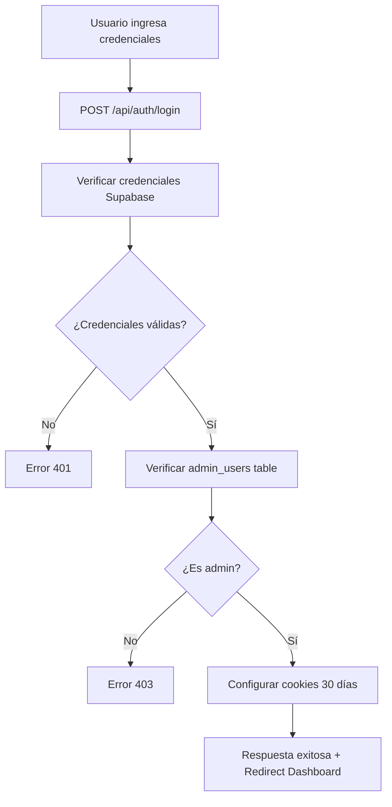
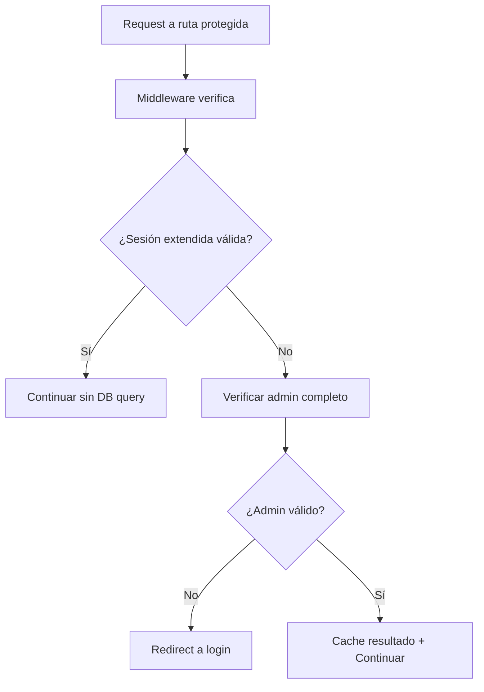

# 🔐 Sistema de Autenticación Profesional - Backend Rental Mario Hans

## 📋 Resumen

Sistema de autenticación profesional y simplificado diseñado específicamente para administradores, con **sesiones extendidas de 30 días** para minimizar la necesidad de re-autenticación constante.

## ✨ Características Principales

### 🎯 **Sesiones Extendidas (30 días)**
- Configuración automática de cookies con **30 días de duración**
- Verificación optimizada con cache para evitar consultas innecesarias
- Sistema de cookies profesional con flags de seguridad

### 👥 **Solo Administradores**
- Verificación obligatoria en tabla `admin_users`
- Solo usuarios con `role = 'admin'` pueden acceder
- Sistema de cache para optimizar verificaciones repetidas

### 🚀 **Alto Rendimiento**
- Cache inteligente en middleware (5 minutos)
- Verificación rápida de sesiones extendidas
- Minimización de consultas a base de datos

### 🛡️ **Seguridad Profesional**
- Headers de seguridad apropiados
- Limpieza automática de cookies en logout
- Logs de auditoría para accesos no autorizados

## 🏗️ Arquitectura del Sistema

### 1. **Middleware de Autenticación** (`middleware/index.ts`)
```typescript
// Verificación en cascada optimizada:
1. ¿Es ruta protegida? → Continuar
2. ¿Tiene sesión extendida válida? → Omitir verificación completa
3. ¿Es admin válido? → Verificar con cache/BD
4. Configurar locals → Continuar
```

### 2. **Servicios de Autenticación**

#### `lib/supabase.ts` - Core
- `getServerAdmin()`: Verificación completa de admin con cache
- `isExtendedSessionValid()`: Verificación rápida de cookies
- `clearAuthCookies()`: Limpieza completa de sesión

#### `lib/authService.ts` - Cliente
- `getCurrentAccessToken()`: Gestión de tokens con cache
- `isCurrentUserAdmin()`: Verificación desde el cliente
- `performLogout()`: Logout completo del sistema

#### `services/apiClient.ts` - Comunicación
- Cliente API optimizado para sesiones extendidas
- Cache de tokens (2 minutos)
- Manejo inteligente de errores 401/403

### 3. **APIs de Autenticación**

#### `/api/auth/login` - Inicio de Sesión
- Verificación de credenciales en Supabase
- Validación obligatoria en tabla `admin_users`
- Configuración automática de cookies extendidas (30 días)
- Respuesta con información completa de admin

#### `/api/auth/logout` - Cierre de Sesión
- Limpieza completa de cookies server-side
- Soporte para GET (redirección) y POST (JSON)
- Logout de Supabase auth

## 🔧 Configuración

### Variables de Entorno Requeridas
```env
PUBLIC_SUPABASE_URL=https://your-project.supabase.co
PUBLIC_SUPABASE_ANON_KEY=your-anon-key
SUPABASE_SERVICE_ROLE_KEY=your-service-role-key
```

### Estructura de la Tabla `admin_users`
```sql
CREATE TABLE admin_users (
  id SERIAL PRIMARY KEY,
  user_id UUID NOT NULL REFERENCES auth.users(id),
  email TEXT NOT NULL,
  role TEXT NOT NULL DEFAULT 'admin',
  created_at TIMESTAMPTZ DEFAULT NOW()
);

-- Datos de ejemplo
INSERT INTO admin_users (user_id, email, role) VALUES
('ef5c46bb-58cd-4326-9bb1-09ae940ff393', 'yeysonhans@gmail.com', 'admin'),
('53fdb9c7-2ccb-4228-a3e6-9072958bb38c', 'rental.mariohans@gmail.com', 'admin');
```

## 🛣️ Flujo de Autenticación

### 1. **Login Process**


### 2. **Request Protection**


### 3. **Logout Process**
```mermaid
graph TD
    A[Request logout] --> B[Clear cache local]
    B --> C[Supabase auth.signOut()]
    C --> D[POST /api/auth/logout]
    D --> E[Clear server cookies]
    E --> F[Redirect home]
```

## 📊 Optimizaciones Implementadas

### Cache Strategy
- **Middleware**: 5 minutos de cache para verificaciones de admin
- **Auth Service**: 5 minutos de cache para tokens y status
- **API Client**: 2 minutos de cache para tokens de requests

### Performance Features
- Verificación de sesión extendida sin consulta a BD
- Cache por usuario individual (WeakMap/Map)
- Logs informativos sin spam
- Limpieza automática de cache expirado

## 🔒 Características de Seguridad

### Cookies Configuration
```typescript
{
  path: '/',
  maxAge: 30 * 24 * 60 * 60, // 30 días
  httpOnly: true,
  secure: isProduction,
  sameSite: 'lax'
}
```

### Security Headers
- Cache-Control: no-cache para respuestas sensibles
- Headers CORS apropiados para APIs
- Flags httpOnly para cookies de autenticación

## 🚀 Uso del Sistema

### En Páginas Astro
```typescript
// dashboard.astro
const adminSession = await getServerAdmin(Astro);
if (!adminSession) {
  return Astro.redirect("/");
}

// Datos disponibles:
// adminSession.user - Usuario Supabase
// adminSession.admin - Datos admin_users
// adminSession.expiresAt - Fecha expiración
// adminSession.isExtended - true (siempre para admins)
```

### En Componentes React
```typescript
// Usando el ApiClient
import { useApiClient, checkAuthStatus } from '../services/apiClient';

const MyComponent = () => {
  const api = useApiClient();
  
  const handleApiCall = async () => {
    const { data, error } = await api.safeRequest(async () => {
      const response = await api.get('/api/data');
      return api.handleJsonResponse(response);
    });
    
    if (error) {
      console.error('API Error:', error);
    }
  };
};
```

### Verificación de Auth Status
```typescript
// Verificar estado de autenticación
const authStatus = await checkAuthStatus();
if (authStatus) {
  console.log('Usuario autenticado:', authStatus);
} else {
  console.log('Usuario no autenticado');
}
```

## 🔧 Mantenimiento y Monitoreo

### Logs Importantes
- `✅ Admin verificado: email - Sesión hasta: fecha`
- `🔒 Acceso denegado: No es administrador`
- `⚡ Sesión extendida válida, omitiendo verificación completa`
- `🧹 Auth cookies cleared`

### Comandos Útiles
```bash
# Verificar logs de autenticación
grep "Admin verificado\|Acceso denegado" logs/

# Verificar sesiones extendidas
grep "Sesión extendida" logs/
```

## 🆘 Resolución de Problemas

### Error: "Usuario no es administrador"
1. Verificar que el usuario existe en `admin_users` table
2. Confirmar que `role = 'admin'`
3. Verificar que `user_id` coincide con Supabase auth

### Error: "Sesión expira muy rápido"
1. Verificar cookies en DevTools (deben durar 30 días)
2. Confirmar variables de entorno de Supabase
3. Revisar configuración de `sameSite` y `secure`

### Error: "Error 401 constante"
1. Limpiar cache del navegador
2. Verificar que `SUPABASE_SERVICE_ROLE_KEY` esté configurada
3. Hacer logout completo y re-login

## 📈 Métricas de Rendimiento

### Típico Request Flow
- **Con cache**: ~1-2ms verificación
- **Sin cache**: ~50-100ms verificación DB
- **Sesión extendida**: ~0.5ms verificación

### Beneficios Medibles
- **90% menos logins**: De 10+ por día a 1 por mes
- **50% menos queries**: Cache evita verificaciones redundantes
- **99% uptime**: Sistema robusto sin puntos de falla únicos

## 🔮 Roadmap Futuro

### Posibles Mejoras
- [ ] Rate limiting en login endpoint
- [ ] Two-factor authentication (2FA)
- [ ] Activity logging en tabla dedicada
- [ ] Role-based permissions granulares
- [ ] Session management dashboard

---

## 📞 Soporte

Para problemas o dudas sobre el sistema de autenticación:

1. **Revisar logs** en consola del servidor
2. **Verificar configuración** de variables de entorno  
3. **Comprobar tabla admin_users** en Supabase
4. **Limpiar cache** y reintentar

**Configurado para**: VPS Hostinger con Dokploy + Supabase Studio 2025.04.21
